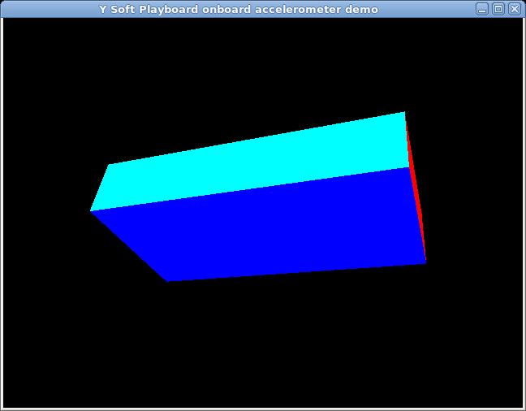

#Python pyfirmata examples

## Semafor
**Included:**
* Use digital I/O pins for LEDs
* Use digital I/O pins in PWM mode for RGB led
* Use analog input for potentiometer

**Source code:** [semafor.py](semafor.py)

**Schema:**

## Onboard temperature and humidity sensors
**Included:**
* I2C communication

Onboard temperature and humidity sensor is connected to the I2C address 0x40.
After command to measure some value there must be some wait before reading out
output value.

**Source code:** [i2c_onboard_temperature.py](i2c_onboard_temperature.py)

## Onboard accelerometer demo (3D OpenGL)
**Included:**
* I2C communication
* Filtering values from sensors
* 3D OpenGL demo

**Source code:** [i2c_onboard_accelerometer.py](i2c_onboard_accelerometer.py)

## RFM69 radio
**Included:**
* Own sysexes to communicate with the onboard radio chip
* Library [RFM69](https://github.com/LowPowerLab/RFM69) and **YiPlayFirmataPlus** needed
* Configuring radio
* Sending and receiving messages

**Source code:** [radio_test.py](radio_test.py)
